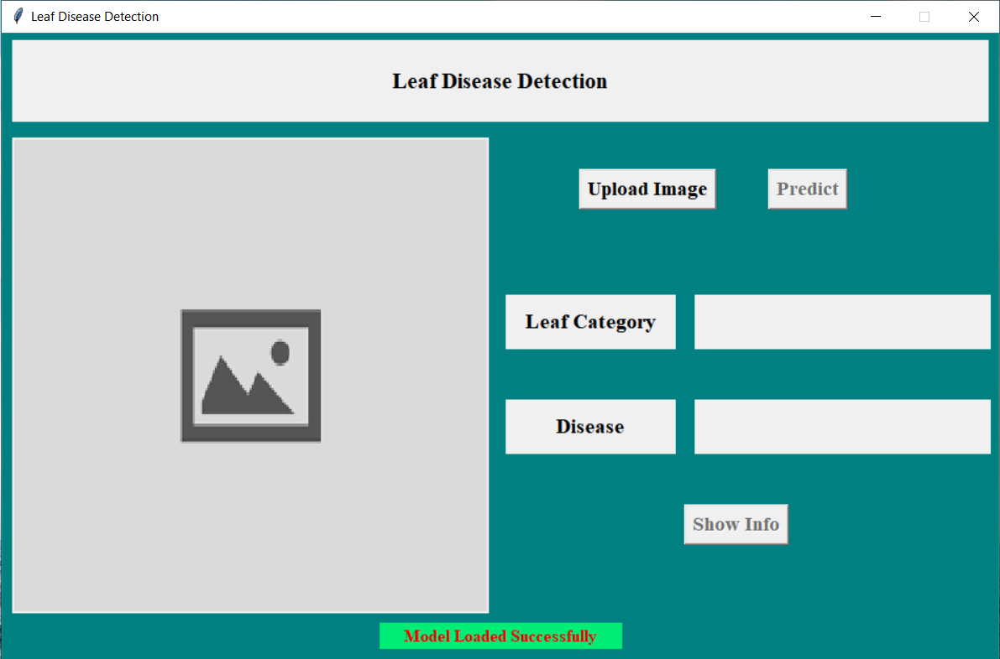
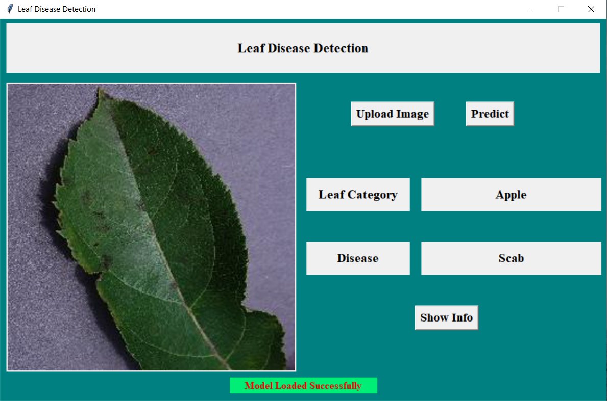
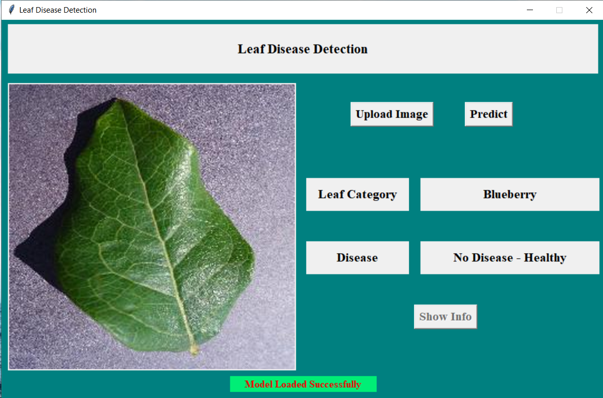
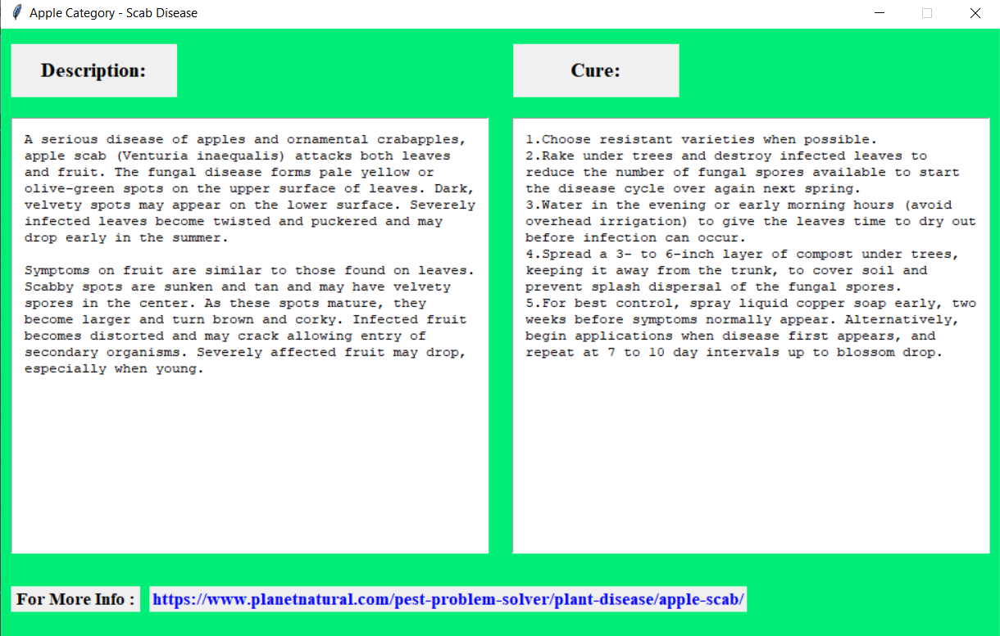
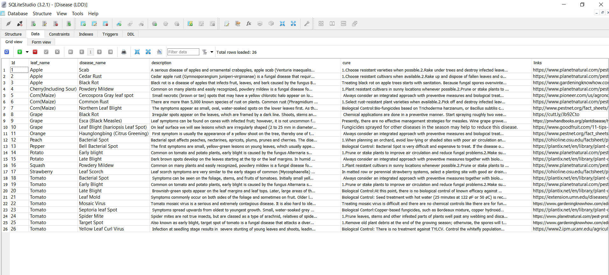

### Leaf-Disease-Detection-using-Machine-Learning

Install SQL Lite studio for database usage

Procedure:

1.Download the Dataset from the below link:
```
https://www.kaggle.com/shankaraditya0693/plantvillage
```
2.Now, you can either have a new model by executing the "Train.py" file or use the saved model

download the saved model here:
```
https://www.kaggle.com/shankaraditya0693/saved-model
```
3.Place the all the files in one folder.
4.Now, open the "Final.py" file and change the folder locations in the code accordingly.
5.Execute the "Final.py" file usnig an IDE or CMD (CMD preferred).
6.A GUI will pop up that is the home screen.



7.Now, click on "Upload Image" button and select an image for disease detection (select from 'val' folder)
8.Now hit the "Predict" button, the output is displayed as follow:


9.If the leaf you selected is healthy, it will display as below and also the "Show Info" button will not work since the leaf is healthy:



10.The database is used in this project to display the description for the disease and also suggest a cure for that.
11.Clicking on "Show Info" button i will pop up another window,


12.In the same window there is an URL provided, for more info on the disease, it's a clickable link.
13.Eveything displayed in the above window is retrived from the database



### Leaf-Disease-Detection-using-Machine-Learning
